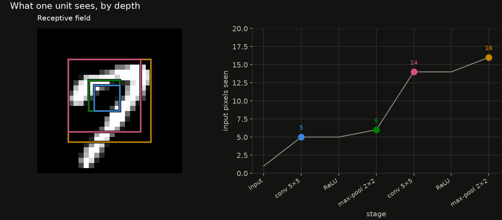
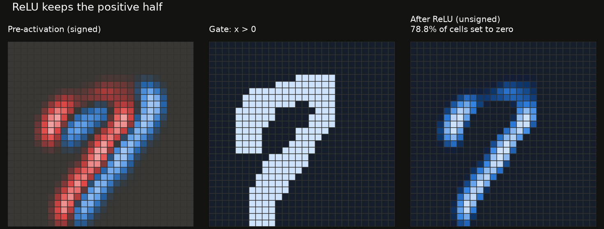
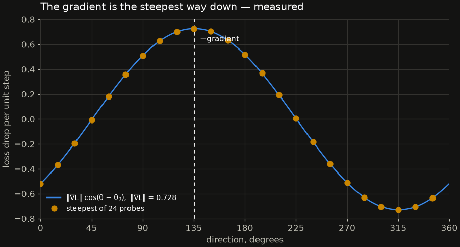
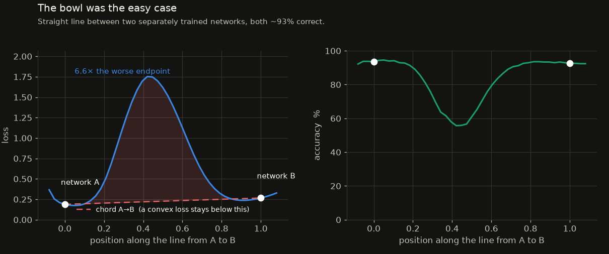
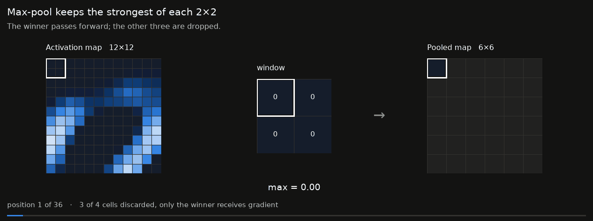
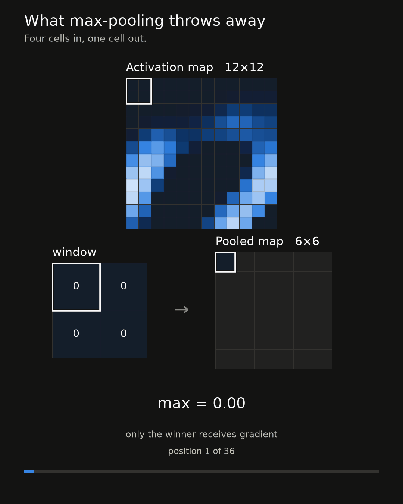

# How a Convolutional Neural Network Learns

A notebook series that explains deep learning **visually**. Every mechanism —
convolution, pooling, backpropagation, gradient descent — is rendered as an
animation built from the actual numbers flowing through an actual network, not
from an illustration drawn to look like one.

The animations are the argument. The prose and the mathematics are there to
tell you what you are looking at.


*From [`01_the_convolution_operation.ipynb`](notebooks/01_the_convolution_operation.ipynb)
— a kernel sweeping a digit. Every number on screen was computed, not drawn.*

## Approach

Two implementations, used deliberately:

- **NumPy, from scratch** (`src/cnnviz/layers.py`) for the early notebooks.
  Every forward and backward pass is written out longhand so any intermediate
  value can be opened up and animated. Nothing is hidden behind a framework
  call.
- **PyTorch** for the deeper networks, where from-scratch training becomes too
  slow. Forward and backward hooks pull out the same quantities, so the
  visual language does not change when the backend does.

The from-scratch layers are checked against PyTorch autograd *and* against
finite differences (`tests/test_layers.py`). A subtly wrong gradient still
trains something, and the resulting animation would confidently show you a
lie.

## Setup

Requires Python 3.10 or 3.11.

```bash
python3.11 -m venv .venv
source .venv/bin/activate
pip install -r requirements.txt
pip install -e .
python -m ipykernel install --user --name cnnviz --display-name "Python (cnnviz)"
jupyter lab
```

Select the **Python (cnnviz)** kernel in each notebook. MNIST downloads
automatically to `data/raw/` on first use (~11 MB, checksum-verified).

Run the test suite with `pytest`.

> **Note on pinned versions.** `torch` is pinned to 2.2.2 and `numpy` to `<2`.
> 2.2.2 is the last PyTorch release with macOS x86_64 (Intel) wheels, and it
> was compiled against the NumPy 1.x C API — with NumPy 2.x installed, every
> `torch` ↔ `numpy` conversion fails at runtime. On Apple Silicon or Linux
> both pins can be relaxed.

## Notebooks

| # | Notebook | Status |
|---|----------|--------|
| 01 | The convolution operation | ✅ complete |
| 02 | Stacking layers — ReLU, pooling, and hierarchy | ✅ complete |
| 03 | The loss landscape and gradient descent | ✅ complete |
| 04 | Backpropagation, step by step | planned |
| 05 | Watching a network train | planned |
| 06 | What the filters learned | planned |
| 07 | Where the network looks — saliency and occlusion | planned |
| 08 | When learning fails — dead units, bad initialisation, overfitting | planned |

### From notebook 02

[`02_stacking_layers.ipynb`](notebooks/02_stacking_layers.ipynb) — what each
layer of a stack actually buys, measured rather than asserted. Every figure
below is one of its outputs; the rest are in [`results/`](results/).


*Seven stages, one column each. Channels go up, resolution comes down — the
shape of nearly every convolutional network ever shipped.*

|  |  |
|---|---|
| **Depth buys context.** Two 5×5 kernels and two poolings put 16 of the digit's 28 pixels behind every output cell — the flat steps are the ReLUs, which widen nothing. | **ReLU is a gate.** It closed on 78.8% of this map: 21.6% genuinely negative — an edge the other way round, gone for good — and the rest flat background. |

### From notebook 03

[`03_the_loss_landscape.ipynb`](notebooks/03_the_loss_landscape.ipynb) — the
number a network is actually minimising, and the surface it makes over the
parameters. The classifier is cut down to **two** weights on purpose: with two,
the contour plot is the entire loss function rather than a slice through one,
and nothing is hidden behind the page.


*Thirty-two steps of `w ← w − η ∇L` on a real surface — binary cross-entropy
over 500 MNIST digits, evaluated at every pixel of that contour. The arrow is
the step actually taken rather than a unit vector, so its shortening as the
ground flattens is data. Nobody chose the final weights; they are where the
slope ran out.*

|  |  |
|---|---|
| **The gradient is measured, not assumed.** Probe 24 directions, divide the drop in loss by the step length, and the answers land on ‖∇L‖ cos θ — peaking on −∇L to within the probe spacing. Half of all directions make the loss *worse*. | **Real landscapes are not bowls.** The straight line between two separately trained 93% networks climbs to 6.6× their loss and falls to 55.7% accuracy. A convex function cannot do that, and the shaded area is the proof. |

The same notebook pins the stability limit of gradient descent: theory puts it
at `2/λmax = 19.05` from the Hessian, bisection finds `19.12`, and the two
agree to 0.36%.

## Layout

```
results/            ← every rendered GIF and figure, one flat folder
  README.md           auto-generated gallery, regenerated by write_index()
notebooks/          the series, in order
src/cnnviz/
  layers.py         from-scratch NumPy layers (Conv2D, ReLU, MaxPool2D, Dense),
                    a Sequential that keeps every intermediate activation, and
                    receptive-field arithmetic
  style.py          shared palette, colormaps, matplotlib defaults
  panels.py         reusable figure components + animation furniture
  animate.py        GIF authoring — palette, timing, encoding
  text.py           localised strings and number formatting (en, pt-BR)
  formats.py        canvas presets for phone feeds and stories
  results.py        the single output folder and its index
  data.py           MNIST download, checksum, and IDX parsing
data/raw/           MNIST cache — gitignored
tests/              correctness tests for the from-scratch layers
```

## Results

Everything the notebooks render lands in **`results/`** — flat, named
`NN_slug`, so sorting the folder reproduces the order of the series and the
GIFs can be picked up and used directly. `results/README.md` is a generated
gallery that displays them inline.

```python
from cnnviz import results

results.output_path("my_animation.gif", notebook=3)   # -> results/03_my_animation.gif
results.write_index()                                  # refresh the gallery
```

## Animation quality

`cnnviz.animate` handles the craft details that separate an authored animation
from a dumped one:

- **One shared colour palette** across all frames. Quantising frames
  independently makes the palette drift, visible as a shimmer on flat areas.
- **Delta encoding + no dithering.** Together with the shared palette this
  takes a typical animation here from ~1.8 MB to ~0.5 MB. Dithering is off
  because it adds noise *and* roughly doubles file size on flat graphics.
- **Variable frame timing** via `animate.hold_at`, so the opening frames can
  be held while the mechanic is learned, and key moments get an extra beat.
- **No layout engine during animation.** An automatic layout solver re-solves
  per frame and lets panels drift by a pixel or two — visible as jitter.
- **Standard furniture** — `panels.frame_header`, `panels.caption`,
  `panels.progress_bar` — so every animation in the series wears the same
  frame. A GIF has no scrubber, hence the progress rule.
- **Connectors placed from the panels themselves.** `panels.arrow_between` and
  `panels.glyph_between` read the axes' realised positions, so a retuned layout
  moves them with the panels instead of leaving them stranded. The arrow also
  takes its direction from where the panels sit — left-to-right in the notebook
  figure, top-to-bottom in the feed cut of the same pipeline.

## Theme and language

The code, prose and documentation are in English, and so is every figure that
illustrates them here. The labels baked into a GIF or figure come from
`cnnviz.text` rather than from the figure code, so theme and language are
switches rather than rewrites — one line at the top of a notebook re-renders
every figure in it:

```python
style.use_project_style(theme="dark")   # "light" | "dark"
text.set_language("en")                 # "en" | "pt-BR"
```

**The dark theme is selected, not inverted.** Three things genuinely reverse
rather than flip, because "near zero recedes toward the surface" means
something different on a dark page:

- the sequential ramp runs dark→light, so the strongest activations do not
  vanish into the background;
- the diverging ramp takes a *dark* neutral midpoint and brightens toward
  both poles, so distance from zero still reads as visual weight;
- digits render bright-on-dark, which is how MNIST actually stores them.

The dark categorical palette is a re-stepping of the same eight hues and was
validated as a set against the dark surface — lightness band, chroma floor,
colour-vision separation, and ≥3:1 contrast.

**One artefact ships localised**, and it is the one that leaves the repository:
notebook 03's feed cut renders in pt-BR, because it gets posted rather than
read here. Everything else stays English.

**Localisation includes numbers.** `text.num()` renders `1,65` in pt-BR and
`1.65` in English, and uses U+2212 for negatives rather than a hyphen. A
figure that translates its labels but leaves a full stop in every cell reads
as half-finished. Note also that translated labels are typically 20–40%
longer — `draw_matrix(..., title_fontsize=...)` exists because
"Feature map" becomes "Mapa de características" and overran the canvas.

**Length is not a footnote.** Rendering that feed cut in pt-BR ran three of its
five captions off the canvas — and measuring properly showed two of the
*English* ones had been overrunning already. A caption is set across the full
width rather than into a panel, and it changes every frame, so a clipped line
reaches a published GIF unnoticed: the frame you happen to open looks fine.
`*_short` strings fixed it, and `test_short_captions_fit_the_portrait_canvas`
now measures rendered text against the canvas in every language, so the next
translation fails a test rather than a post.

## Posting to social media

`cnnviz.formats` carries canvas presets for phone-sized output, and a feed cut
is a **different layout on a different canvas** — not the wide notebook figure
scaled down, which ends up with type a few pixels tall.

<table>
<tr>
<td></td>
<td></td>
</tr>
</table>

*The same animation, twice. Same numbers, same colour scale, different layout:
the wide cut reads at leisure, the portrait one has to work at arm's length on
a phone.*

| Preset | Pixels | For |
|---|---|---|
| `FEED_PORTRAIT` | 1080×1350 (4:5) | Instagram/Facebook feed — most screen while scrolling |
| `FEED_SQUARE` | 1080×1080 (1:1) | Safe everywhere, uncropped in grid previews |
| `STORY` | 1080×1920 (9:16) | Stories, Reels, TikTok |

**Instagram and TikTok do not accept GIF uploads.** X/Twitter and WhatsApp
accept them but transcode to video anyway; LinkedIn takes either. Pass
`mp4=True` to `animate()` and an H.264 file is written beside the GIF — usually
*smaller*, and actually postable. Keep the GIF for GitHub, docs and messaging.

The MP4 is built to clear what the feeds actually check, none of which is
visible by looking at the file play correctly on a laptop:

| Property | What `save_mp4` writes | Why |
|---|---|---|
| Codec / chroma | H.264, `yuv420p` | libx264 picks `yuv444p` for RGB input, and the result fails to open on exactly the phones it is for |
| Audio | a **silent AAC track** | a file with no audio stream at all is refused by parts of the posting chain — the specs name an audio codec and the schedulers enforce it |
| Dimensions | forced even | H.264 cannot encode an odd row or column |
| Layout | `+faststart` | the header goes at the front, so an uploader can read the video before it has all of it |
| Duration | your business | under ~3 seconds a feed video is rejected; hold frames rather than adding them |

Two things that bite when rendering at feed size:

- **Raise the palette.** At 64 colours the shared palette starts approximating
  greyscale pixels with nearby blues and reds, putting a visible colour cast
  on the digit. A frame mixing a grey ramp with a diverging one needs ~160.
- **Shorten the copy.** Use the `*_short` strings rather than the full title at
  a smaller size. A title that must be squinted at is worse than a short one
  that reads at a glance.

## Visual conventions

These are enforced by `style.py` and applied consistently across the series,
so a reader learns the encoding once:

| Quantity | Encoding | Why |
|---|---|---|
| Raw imagery (input digits) | greyscale | a photograph, not an encoding; colouring it competes with the encoded panels beside it |
| Signed values (weights, gradients, pre-activations) | diverging blue↔red, centred on zero | `-0.4` and `+0.4` must be equally saturated, or the viewer reads a bias that is not in the data |
| Unsigned magnitudes (post-ReLU activations) | sequential blue, anchored at zero | "no activation" must always be the palest colour |
| Curves over time (loss, accuracy) | categorical hues in fixed slot order | never cycled, so a colour means the same entity in every notebook |
| Not-yet-computed cells | flat neutral (`style.EMPTY`) | must stay distinguishable from a genuine zero |

Three rules that matter more than they sound:

- **Diverging ramps are always centred on zero**, never on the data's mean.
- **Feature-map grids share one scale across channels.** Per-panel scaling
  makes a nearly dead channel look as active as a strongly firing one — the
  single most misleading thing a contact sheet can do. Scales do change from
  one *stage* of a network to the next, because the quantities differ: a signed
  pre-activation and an unsigned post-ReLU magnitude must not share a ramp.
- **Animated panels take a scale fixed over the whole sequence**, passed via
  `draw_matrix(..., norm=...)`. The same trap as above, in the time dimension:
  a panel that rescales to its own frame renders nine near-zero products as
  vividly as a strong edge, and the colour ends up contradicting the number
  printed beside it.


*Why the shared scale is not a detail. One unit, four thresholds, one scale
across all four: the response visibly narrows **and** dims until the unit is
dead. Scaled per panel, the last three would each look as strong as the first,
and the figure would say the opposite of what it means.*
