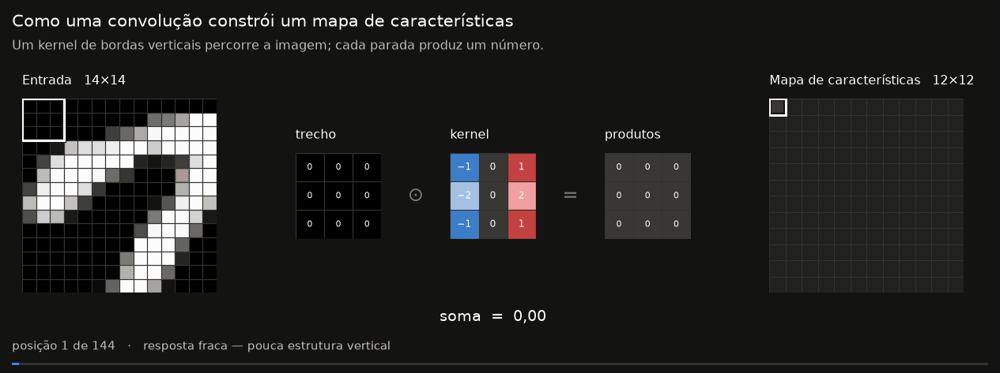
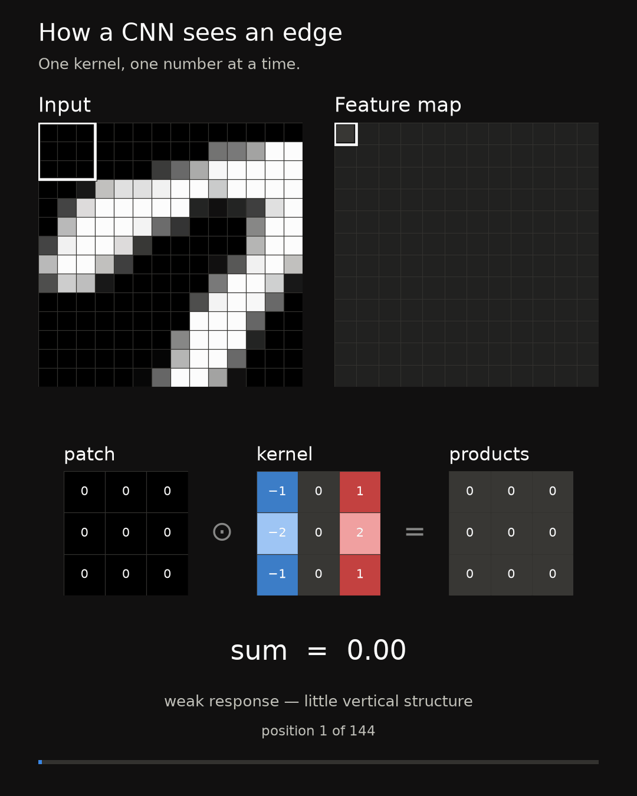
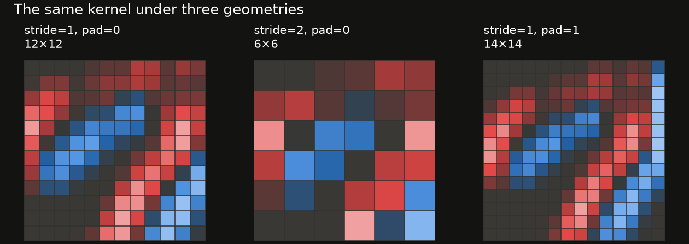
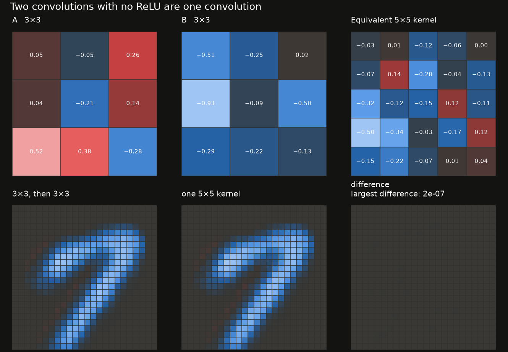
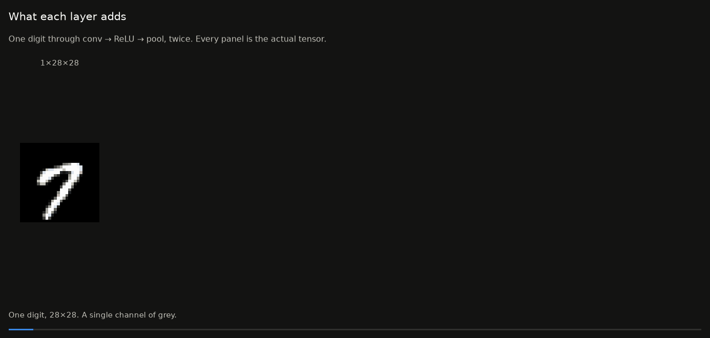
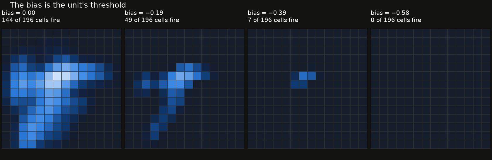

# Results

Every animation and figure produced by the notebook series, in one folder. Files are named `NN_slug`, where `NN` is the notebook that produced them.

_Regenerated 2026-07-26 by `cnnviz.results.write_index()`._

---

### 01 convolution sweep

`01_convolution_sweep.gif` · 0.85 MB

### 01 convolution sweep feed

`01_convolution_sweep_feed.gif` · 1.82 MB

### 01 convolution sweep feed (video)

[01_convolution_sweep_feed.mp4](01_convolution_sweep_feed.mp4) · 1.11 MB — post this to Instagram or TikTok; neither accepts GIF.

### 01 geometries

`01_geometries.png`

### 02 linear collapse

`02_linear_collapse.png`

### 02 maxpool sweep

`02_maxpool_sweep.gif` · 0.18 MB

### 02 maxpool sweep feed

`02_maxpool_sweep_feed.gif` · 0.31 MB

### 02 maxpool sweep feed (video)

[02_maxpool_sweep_feed.mp4](02_maxpool_sweep_feed.mp4) · 0.26 MB — post this to Instagram or TikTok; neither accepts GIF.

### 02 receptive field

`02_receptive_field.png`

### 02 relu gate

`02_relu_gate.png`

### 02 stack forward

`02_stack_forward.gif` · 0.09 MB

### 02 stack forward feed

`02_stack_forward_feed.gif` · 0.09 MB

### 02 stack forward feed (video)

[02_stack_forward_feed.mp4](02_stack_forward_feed.mp4) · 0.14 MB — post this to Instagram or TikTok; neither accepts GIF.

### 02 threshold

`02_threshold.png`
